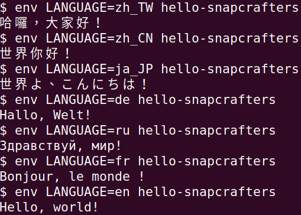

# Unofficial Snap Packaging for GNU Hello
<!--
	Use the RawGit service for easy access to in-repo pictures:
	https://rawgit.com
-->
 Icon of GNU Hello")

**This is the unofficial snap for GNU Hello**, *"A familiar, friendly greeting(also a demonstration of snap packaging)"*. It works on Ubuntu, Fedora, Debian, and other major Linux distributions.

Published for  with 💝 by Snapcrafters

## Installation
([Don't have snapd installed?](https://snapcraft.io/docs/core/install))

### In Terminal
    # Install Snap #
    sudo snap install hello-snapcrafters

### The Graphical Way
Browse <https://snapcraft.io/hello-snapcrafters> and follow the instructions.

## What is Working
* Display default greeting

## What is NOT Working...yet
Check out the [issue tracker](https://github.com/Lin-Buo-Ren/hello-snap/issues) for more known issues.

## What is NOT Tested...yet
Anything not mentioned in the "What is Working" and "What is NOT Working...yet" section.

## Support
* Report issues regarding using this snap to the issue tracker:  
  <https://github.com/Lin-Buo-Ren/hello-snap/issues>
* You may also post on the Snapcraft Forum, under the `snap` topic category:  
  <https://forum.snapcraft.io/c/snap>

